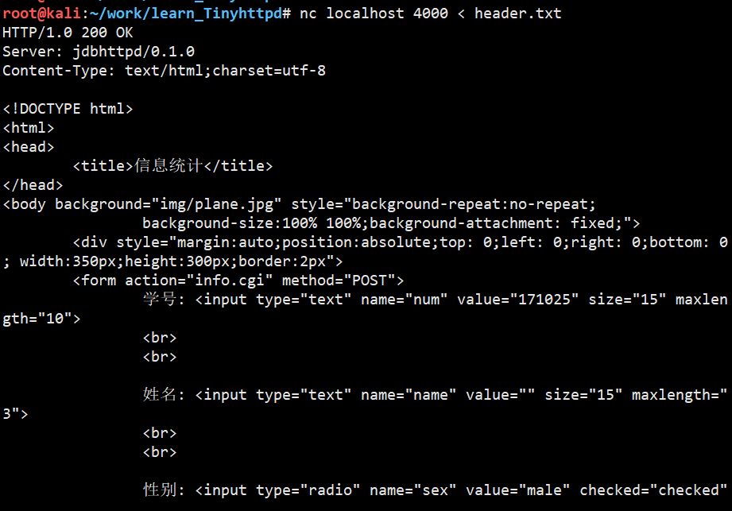
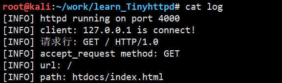
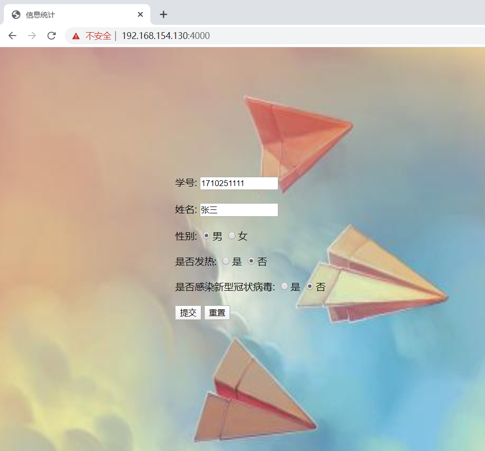
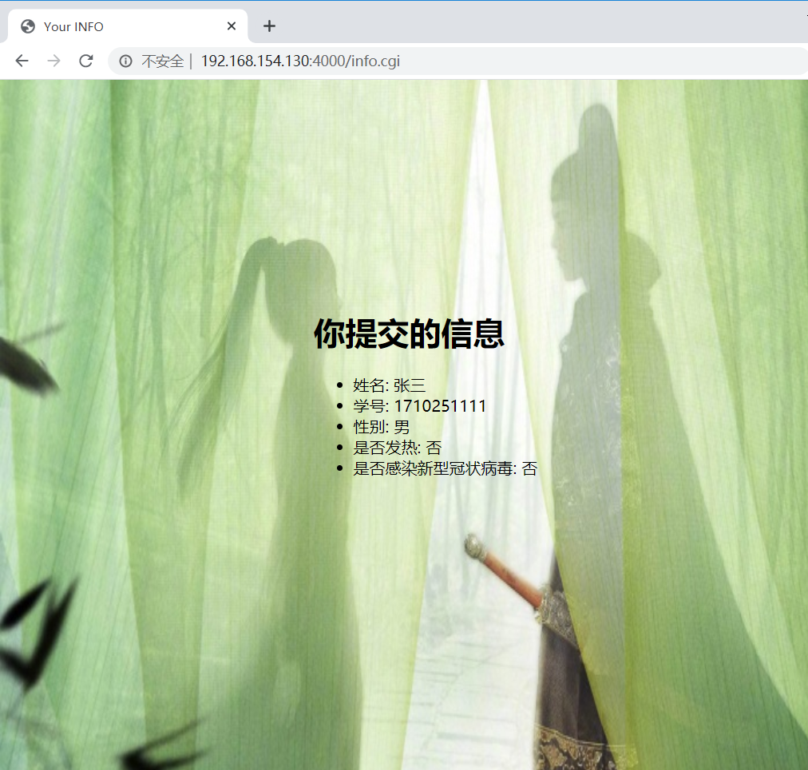
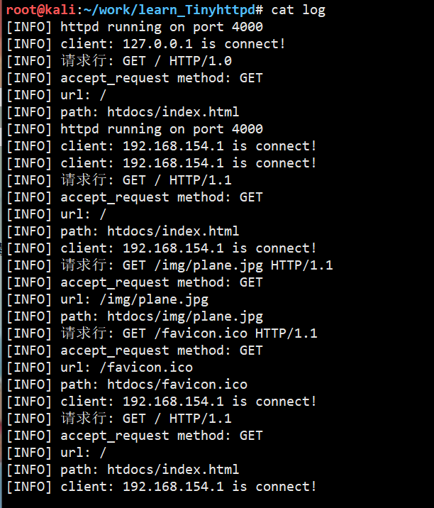
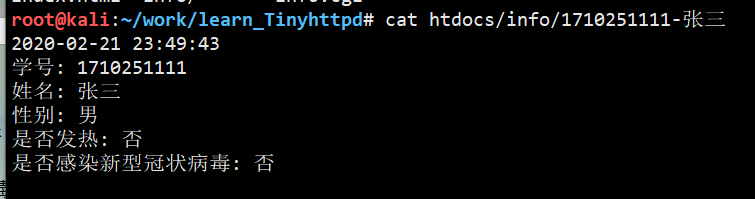

## 介绍

基于[Tinyhttpd](https://sourceforge.net/projects/tinyhttpd/)做的一个简单的信息统计

- 浏览器通过POST请求将表单发给服务器
- 服务器调用CGI程序处理表单数据
- 服务器保存接受到的数据
- 服务器返回数据到浏览器


## 测试

### 配置环境

```
git clone git@github.com:Sanzona/learn_Tinyhttpd.git
cd learn_Tinyhttpd
make
./httpd
```


### 命令行测试







### 浏览器测试













部署到服务器, 需要开启端口4000
