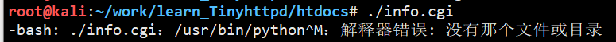
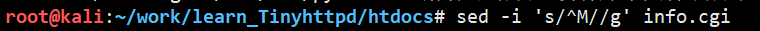

## HTTP请求

http请求有三部分组成，请求行，消息报头，请求正文

```bash
Request Line<CRLF>  # 请求行
Header-Name: header-value<CRLF>  # 消息报头
Header-Name: header-value<CRLF>
<CRLF>
body  # 请求正文
```

1. 请求行

   ```bash
   Method Request-URI HTTP-Version CRLF
   ```

   - Method表示请求方法

     | 方法    | 描述                                                         |
     | ------- | ------------------------------------------------------------ |
     | GET     | 请求指定的页面信息, 返回实体主体                             |
     | POST    | 向指定资源提交数据进行处理请求(提交表单或上传文件). 数据被包含在请求体中. POST请求可能会导致新的资源的建立或已有资源的修改 |
     | HEAD    | 类似GET请求, 只不过返回的响应中没有具体的内容, 用户获取报头  |
     | PUT     | 从客户端向服务器传送的数据取代指定的文档内容                 |
     | DELETE  | 请求服务器删除指定的页面                                     |
     | CONNECT | HTTP/1.1协议中预留给能够将连接改为管道方式的代理服务器       |
     | OPTIONS | 允许客户端查看服务器的性能                                   |
     | TRACE   | 回显服务器收到的请求, 主要用于测试或诊断                     |
     | PATCH   | 对PUT方法的补充, 用来对已知资源进行局部更新                  |

     前三种时HTTP1.0定义的三种请求方法, 后六种时HTTP1.1新增的请求方法

   - GET例子

     ```bash
     GET /form.html HTTP/1.1 (CRLF)
     ```

   - POST例子

     ```bash
     POST /reg.jsp HTTP/ (CRLF)
     Accept:image/gif,image/x-xbit,... (CRLF)
     ...
     HOST:www.guet.edu.cn (CRLF)
     Content-Length:22 (CRLF)
     Connection:Keep-Alive (CRLF)
     Cache-Control:no-cache (CRLF)
     (CRLF)         
     user=jeffrey&pwd=1234  # 提交的数据
     ```

     

## CGI

### 基本原理

CGI指通用网关接口，是Web服务器提供信息服务的标准接口。通过CGI接口，Web服务器可以获取客户端提交的信息，转交给服务器端的CGI程序进行处理，最后返回结果到客户端。

CGI有两部分组成：客户端显示的HTML、运行在服务器的CGI程序

服务器和CGI程序通过标准输入输出进行数据通信，需要环境变量进行协作

- 服务器URL指向应用程序
- 服务器为应用程序执行做准备
- 应用程序执行，读取标准输入和环境变量
- 应用程序进行标准输出


### 环境变量

CGI程序继承了系统的环境变量。CGI环境变量在CGI程序启动初始化， 在结束时销毁。

- 与请求相关的环境变量

  | REQUEST_METHOD  | 服务器与CGI程序之间的传输方式                  |
  | --------------- | ---------------------------------------------- |
  | QUERY_STRING    | GET传输的信息                                  |
  | CONTENT_LENGTH  | STDIO有效信息长度                              |
  | CONTENT_TYPE    | 指示传来信息的MIME类型                         |
  | CONTENT_FILE    | 使用Windows HTTPd/WinCGI标准，传送数据的文件名 |
  | PATH_INFO       | 路径信息                                       |
  | PATH_TRANSLATED | CJGI程序的完整路径名                           |
  | SCRIPT_NAME     | 调用CGI程序名                                  |


## 判断文件结束标记EOF

本函数在void cat(int client, FILE *resource)出现

```c
int feof(FILE *fp);
// 文件结束返回非零
// 文件未结束返回零
```

feof函数只用于检测流文件, 当文件内部位置指向文件结束时, 不会立即置位FILE结构中的文件结束标记, 只有再执行一次读文件操作, 才会置为结束标记. 之后调用feof返回真.


可以采用"先读取再输出接着读取然后判断"的方式, 避免错误.


还有就是fgets遇到EOF会立即置结束标记, 所以文本末尾要有换行, 否则feof会直接返回真.


## 获取文件的总字节数

```c
FILE *fp = fopen("txt", "rb");
fseek(fp, 0, SEEK_END);
int len = ftell(fp); // 获取文件偏移量
fseek(fp, 0, SEEK_SET);

字节数: len
```


## int, size_t, ssize_t

size_t无符号数用来表示对象的大小, 在不同的操作系统的长度不同

32位架构中 ```typedef unsigned int size_t```

64位架构中```typedef unsigned long size_t```

ssize_t有符号整型, 32位等同int, 64位等同long int

size_t一般用来计数(sizeof)

ssize_t用来表示被执行读写操作的数据块的大小


### 缓冲区

- 全缓冲

  - 缓冲区满输出
  - 程序结束输出
  - 刷新缓冲区输出(fflush(stdout))

- 行缓冲

  - \n输出
  - 缓冲区满输出
  - 程序结束输出
  - 刷新缓冲区输出

  标准输入, 标准输出都是行缓冲

- 不缓冲

  - 直接输出

  write, 标准出错等


```c
#include <sys/types.h>
#include <stdlib.h>
#include <stdio.h>
#include <fcntl.h>
#include <unistd.h>
/* 	int setvbuf(FILE *stream, char *buffer, int mode, size_t size)
	stream 	指向FILE对象
	buffer 	用户分配的缓冲
	mode   	指定文件缓冲模式
		_IOFBF 全缓冲
		_IOLBF 行缓冲
		_IONBF 无缓冲
	size   	缓冲区大小
*/
int main() {

	char buf[5] = "hell";
	setvbuf(stdout, buf, _IONBF, sizeof(buf));
	while (1) {
		sleep(1);
		printf("%s", buf);
	}

	return 0;
}
```


## 出错处理

1. 

   运行CGI程序出错, 原因是在Windows下编写的.sh .py文件可能存在不可见字符, 行尾标记不同造成的.

   解决方法:

   

   其中^M的输入方法是先按CTRL + v, 然后松开v按m.

   

2. dup2重定向输出, 标准库函数printf变为全缓冲

   - 改用write函数

     printf是行缓冲, write没有缓冲区直接输出.

   - 每次printf之后fllush(stout)刷新缓冲区

   - 


## 参考文档

[CGI详解](https://blog.csdn.net/LiuNian_SiYu/article/details/60964966)

[Python CGI编程](https://www.runoob.com/python/python-cgi.html)

[**/usr/bin/python^M: bad interpreter: 没有那个文件或目录**](http://www.suiyiwen.com/question/4185)


