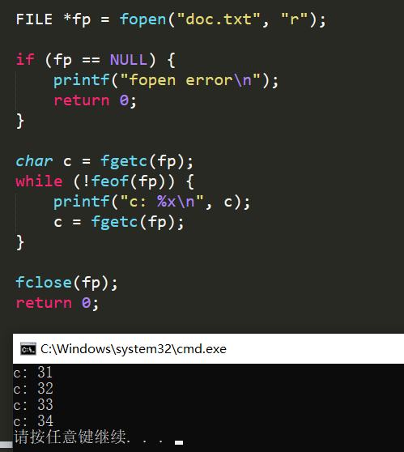
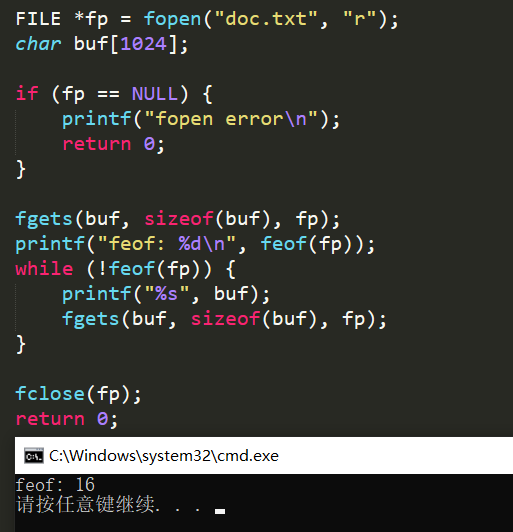

## HTTP请求

http请求有三部分组成，请求行，消息报头，请求正文

```bash
Request Line<CRLF>  # 请求行
Header-Name: header-value<CRLF>  # 消息报头
Header-Name: header-value<CRLF>
<CRLF>
body  # 请求正文
```

1. 请求行

   ```bash
   Method Request-URI HTTP-Version CRLF
   ```

   - Method表示请求方法

     | 方法    | 描述                                                         |
     | ------- | ------------------------------------------------------------ |
     | GET     | 请求指定的页面信息, 返回实体主体                             |
     | POST    | 向指定资源提交数据进行处理请求(提交表单或上传文件). 数据被包含在请求体中. POST请求可能会导致新的资源的建立或已有资源的修改 |
     | HEAD    | 类似GET请求, 只不过返回的响应中没有具体的内容, 用户获取报头  |
     | PUT     | 从客户端向服务器传送的数据取代指定的文档内容                 |
     | DELETE  | 请求服务器删除指定的页面                                     |
     | CONNECT | HTTP/1.1协议中预留给能够将连接改为管道方式的代理服务器       |
     | OPTIONS | 允许客户端查看服务器的性能                                   |
     | TRACE   | 回显服务器收到的请求, 主要用于测试或诊断                     |
     | PATCH   | 对PUT方法的补充, 用来对已知资源进行局部更新                  |

     前三种时HTTP1.0定义的三种请求方法, 后六种时HTTP1.1新增的请求方法

   - GET例子

     ```bash
     GET /form.html HTTP/1.1 (CRLF)
     ```

   - POST例子

     ```bash
     POST /reg.jsp HTTP/ (CRLF)
     Accept:image/gif,image/x-xbit,... (CRLF)
     ...
     HOST:www.guet.edu.cn (CRLF)
     Content-Length:22 (CRLF)
     Connection:Keep-Alive (CRLF)
     Cache-Control:no-cache (CRLF)
     (CRLF)         
     user=jeffrey&pwd=1234  # 提交的数据
     ```

     

## CGI

### 基本原理

CGI指通用网关接口，是Web服务器提供信息服务的标准接口。通过CGI接口，Web服务器可以获取客户端提交的信息，转交给服务器端的CGI程序进行处理，最后返回结果到客户端。

CGI有两部分组成：客户端显示的HTML、运行在服务器的CGI程序

服务器和CGI程序通过标准输入输出进行数据通信，需要环境变量进行协作

- 服务器URL指向应用程序
- 服务器为应用程序执行做准备
- 应用程序执行，读取标准输入和环境变量
- 应用程序进行标准输出


### 环境变量

CGI程序继承了系统的环境变量。CGI环境变量在CGI程序启动初始化， 在结束时销毁。

- 与请求相关的环境变量

  | REQUEST_METHOD  | 服务器与CGI程序之间的传输方式                  |
  | --------------- | ---------------------------------------------- |
  | QUERY_STRING    | GET传输的信息                                  |
  | CONTENT_LENGTH  | STDIO有效信息长度                              |
  | CONTENT_TYPE    | 指示传来信息的MIME类型                         |
  | CONTENT_FILE    | 使用Windows HTTPd/WinCGI标准，传送数据的文件名 |
  | PATH_INFO       | 路径信息                                       |
  | PATH_TRANSLATED | CJGI程序的完整路径名                           |
  | SCRIPT_NAME     | 调用CGI程序名                                  |


## 判断文件结束标记EOF

本函数在void cat(int client, FILE *resource)出现

```c
int feof(FILE *fp);
// 文件结束返回非零
// 文件未结束返回零
```

feof函数只用于检测流文件, 当文件内部位置指向文件结束时, 不会立即置位FILE结构中的文件结束标记, 只有再执行一次读文件操作, 才会置为结束标记. 之后调用feof返回真.


可以采用"先读取再输出接着读取然后判断"的方式, 避免错误.



还有就是fgets遇到EOF会立即置结束标记, 所以文本末尾要有换行, 否则feof会直接返回真.




## 参考文档

[CGI详解](https://blog.csdn.net/LiuNian_SiYu/article/details/60964966)


