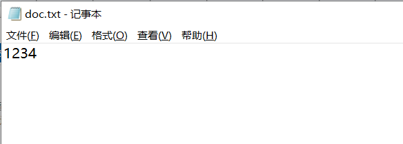
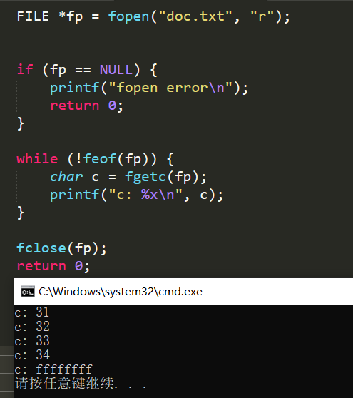
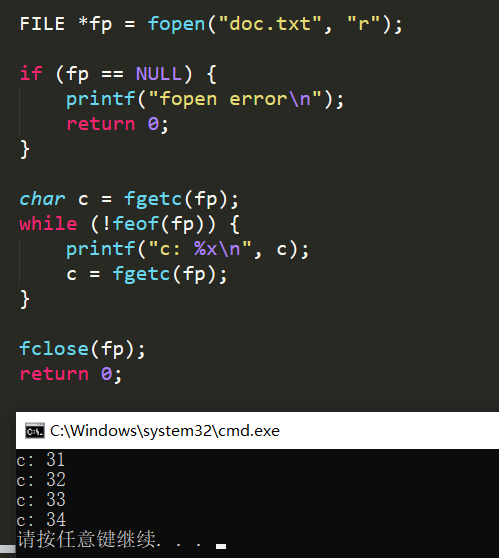
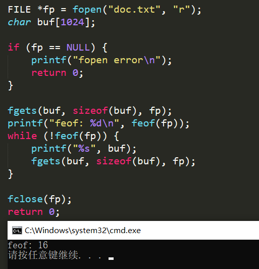

1. 判断文件结束标记EOF

   本函数在void cat(int client, FILE *resource)出现

   ```c
   int feof(FILE *fp);
   // 文件结束返回非零
   // 文件未结束返回零
   ```

   feof函数只用于检测流文件, 当文件内部位置指向文件结束时, 不会立即置位FILE结构中的文件结束标记, 只有再执行一次读文件操作, 才会置为结束标记. 之后调用feof返回真.

   

   

   可以采用"先读取再输出接着读取然后判断"的方式, 避免错误.

   

   还有就是fgets遇到EOF会立即置结束标记, 所以文本末尾要有换行, 否则feof会直接返回真.

   


2. 